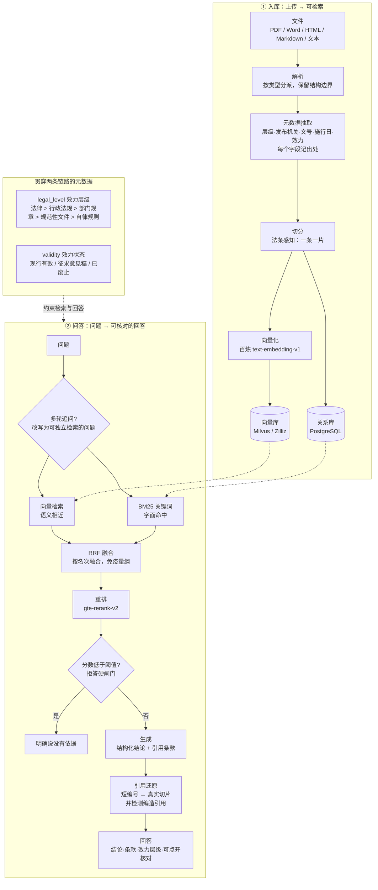

# 金融监管法规知识库

一个面向**证券期货监管法规**的检索增强问答系统。上传法规文件，它会解析、切分、向量化，
然后基于原文回答问题，并且**每条结论都能指回具体的条款**。

它不是"文档搜索框"。合规场景里真正要回答的是"这个能不能做、依据是什么、这个依据算不算数"，
所以系统在普通 RAG 之外额外管住了三件事：**引用能不能指到条**、**依据的效力是什么层级**、
**资料里没有依据时敢不敢说没有**。

---

## 架构



---

## 目录结构

```
vibe-rag/
├── backend/                后端（FastAPI）
│   ├── app/
│   │   ├── api/v1/         接口层
│   │   ├── core/           向量库 / 关系库 / 模型调用
│   │   ├── models/         数据模型
│   │   ├── rag/            解析·切分·检索·问答（本项目的主体）
│   │   └── services/       业务编排
│   ├── requirements.txt
│   └── .env.example        配置模板（真正的 .env 不提交）
├── web/                    前端（原生 HTML/CSS/JS，由后端同源托管）
├── 语料/                    语料，按法的层级分目录
│   ├── 法律层级/ 行政法规/ 部门规章/ 规范性文件/ 自律规则/
│   └── _原始件/             原始下载文件与已被替换的旧版本（不入库）
├── 工具/                    可复用的运维工具（见下）
├── 评测/                    评测脚本与评测集
└── 语料元数据核对.json        人工核对过的法规元数据
```

---

## 几个关键设计

### 1. 一条法规 = 一个切片

通用的"结构感知切分"允许相邻小片段合并到目标长度。这在中小学讲义、技术文档里是对的，
但法规场景会出问题：三条各 150 字的法条会被并成一片 450 字的切片，于是

* **向量被平均掉**——一片混了三个主题，谁都不像；
* **引用说不清**——答案是"第二十九条"，但切片里躺着三条，高亮哪一段？

所以这里加了一种 `legal` 策略，规则只有一条：**一条 = 一片，绝不跨条合并。**
超长条才在条内降级切分，且每一片都带着条号前缀。

配套的难点是**怎么认出"条"的起点**。真实的抽取文本里，"第X条"有三种身份：
真条文起点、跨条引用（"违反本办法第二十九条"）、以及被排版拆开的半截
（"第\n十八\n条"）。代码里用了一组**局部判据**来区分，而不是依赖文档顺序——
因为实测发现，PDF 的文本抽取顺序本身就可能是乱的。

### 2. 效力层级是答案的一部分

同一条规则写在《证券法》里和写在行业协会自律规则里，约束力完全不同：
前者违反面临行政处罚，后者只是自律处分。

所以系统为每份文档抽取 `legal_level`（五级）与 `validity`（现行有效/征求意见稿/已废止），
并且：

* 这两个字段进了向量库的过滤字段，检索时可以按层级筛；
* 生成时把它们一并交给模型，**硬性要求回答里点明依据出自哪一层**；
* 只有自律规则支持某个结论、而用户问的是"是否违法"时，必须说明这一点。

### 3. 元数据必须带出处

元数据是正则从正文里猜的，必然有猜错的时候。所以每个字段都记一条 evidence
（"这个日期是从哪句话里看出来的"），人工核对时只需要核对，不用重读全文。

人工核对的结论固化在 `语料元数据核对.json` 里，**入库流程会读它**——
这样"人工核对"是一次性投入，不是每次重新入库都要重做一遍。
显式的 `null` 表示"人工确认过：这个值应当为空"，用来覆盖自动抽取到的错误值。
留一个空值比留一个看起来像样的错值安全，因为空值会出现在待复核清单里，错值不会。

### 4. 抽不到的不等于没有

解析质检会把"没抽到"和"没有"分开：抽不到的字段进"待人工复核"清单，
空白页比例过高会告警，文本层损坏（汉字占比异常低）会被单独点名。

这条是被真实数据逼出来的：语料里有一份 12.5MB 的 PDF，
用阅读器打开一切正常，但文本层是坏的——抽出来 67 万字里**汉字占比 0%**，
全是字形索引。直接入库会往库里灌近 1600 片乱码，而且**不报错**。

---

## 真实数据

当前语料：**21 份**法规文件（法律 3 · 行政法规 2 · 部门规章 10 · 规范性文件 2 · 自律规则 4），
覆盖证券、期货、基金三条业务线的投资者适当性管理。

| 指标 | 数值 |
|---|---|
| 正文总量 | 183,315 字 |
| 识别条文 | 1,146 条 |
| 切片总数 | 1,281 片 |
| 残句率 | 0% |
| 条界精度 | 有"条"结构的 11 份里，9 份零缺口零重号 |

评测结果见 `评测/评测报告.md`。

---

## 快速开始

### 依赖

* Python 3.11+
* PostgreSQL（存文档、切片、日志）
* 向量库：Milvus / Zilliz Cloud
* 阿里云百炼 API Key（对话 + 向量化 + 重排）

### 步骤

```bash
# 1. 安装依赖
python -m venv .venv
.venv/Scripts/pip install -r backend/requirements.txt

# 2. 配置
cp backend/.env.example backend/.env
# 填 POSTGRES_DSN / DASHSCOPE_API_KEY / MILVUS_URI / MILVUS_TOKEN

# 3. 建表（并给已有表补新增字段）
python 工具/升级表结构.py --apply

# 4. 入库语料
python 工具/入库.py --apply

# 5. 启动（前端由后端同源托管，只有一个地址）
python -m uvicorn app.main:app --host 127.0.0.1 --port 8000
```

打开 <http://127.0.0.1:8000> 即可。

---

## 工具

都在 `工具/` 下，每个都可以单独运行，也都可以安全地重复运行。

| 工具 | 用途 |
|---|---|
| `语料体检.py` | 全量跑解析+切分，产出体检报告（条数、切片数、残句率、缺口、文本层可用性） |
| `校验条界.py` | 检验"一条一片"做没做到：条号连续性、重号、被过滤的引用 |
| `入库.py` | 批量入库；复用网页上传的同一条流水线；按内容指纹幂等 |
| `入库后校验.py` | 关系库/向量库对账 + 检索冒烟测试 |
| `诊断检索.py` | 把向量路、BM25 路、RRF、重排**拆开看**，定位"检索不准"出在哪一步 |
| `升级表结构.py` | 扫描模型与数据库的字段差异并补齐（幂等；`create_all` 不会给已有表加字段） |
| `重建向量库.py` | 删除并重建向量集合（schema 变更时必须重建；需显式 `--yes`） |
| `备份数据库.py` | 导出文档与切片，清库前留档 |
| `拆分公报.py` | 把"一份令 + 多个附件"的公报拆成一份份独立法规文件 |
| `诊断向量库.py` | 分层判断连接问题：DNS / TLS / 鉴权 |
| `等待向量库.py` | 托管向量库恢复期间轮询等待 |
| `查看集合.py` | 列出向量库里的集合与规模 |

---

## 已知边界

* **"《某法规》第X条"这类查询仍然偏弱。** 混合检索 + 重排在候选池变大时不稳定：
  同一个查询，候选池取 top-5 时能把正确的条款排到第 1 名，取 100 条时却排到了别的文件。
  根因是查询里法规名占了大半、真正的检索意图只有"第X条"几个字。
  正确解法是**结构化检索**（识别出"法规名 + 条号"后先做精确条款定位，再与语义结果合并），
  而不是继续调重排参数。
* **表格类内容尚未结构化。** docx 里的表格目前只读取正文，会在解析报告里明确标注
  "有 N 个表格未入库"，而不是静默丢弃。
* **只覆盖国内法规。** 问境外规则（如 SEC、MiFID II）应当明确拒答。
* **只保留现行有效版本，不做历史版本对比。**

---

## 技术选型

| 环节 | 选择 | 为什么 |
|---|---|---|
| 后端 | FastAPI | 原生异步、自动生成 OpenAPI 文档；前端由它同源托管，一个进程一个端口，没有跨域和构建步骤 |
| 解析 | pypdf / python-docx / lxml | 按文件类型分派，因为不同格式的结构信息藏在完全不同的地方 |
| 切分 | 自研（法条感知 + 结构感知 + 长度兜底） | 三级降级；法条感知是法规场景的核心能力，通用切分器做不到 |
| 向量库 | Milvus / Zilliz Cloud | 显式 schema，过滤字段可控；规模上来可平滑扩容 |
| 关键词检索 | BM25（内存索引） | 法规编号的语义信息极弱，向量模型不敏感；BM25 靠字面匹配恰好补上 |
| 融合 | RRF | 两路分数**量纲不同**，加权就得先归一化，而归一化本身又要调参；RRF 只用名次，免疫量纲 |
| 重排 | gte-rerank-v2 | 召回与精排分离；重排失败时退回原顺序，不中断 |
| 生成 | qwen-plus | 与向量化、重排共用同一个 Key，减少外部依赖 |
| 关系库 | PostgreSQL | 文档、切片、日志、用量都在一处；与向量库不一致时以它为准 |

---

## 许可

语料全部来自公开渠道（中国政府网、证监会、交易所与行业协会官网）。
代码部分可自由参考。
