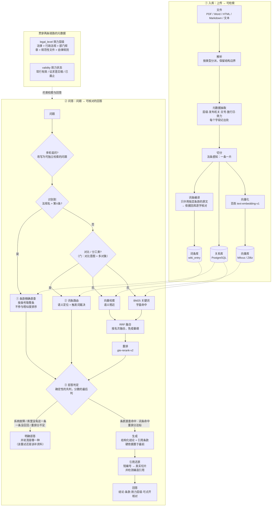

# 金融监管法规知识库

一个面向**证券期货监管法规**的检索增强问答系统。上传法规文件，它会解析、切分、向量化，
然后基于原文回答问题，并且**每条结论都能指回具体的条款**。

它不是"文档搜索框"。合规场景里真正要回答的是"这个能不能做、依据是什么、这个依据算不算数"，
所以系统在普通 RAG 之外额外管住了三件事：**引用能不能指到条**、**依据的效力是什么层级**、
**资料里没有依据时敢不敢说没有**。

---

## 架构



---

## 目录结构

```
vibe-rag/
├── backend/                后端（FastAPI）
│   ├── app/
│   │   ├── api/v1/         接口层
│   │   ├── core/           向量库 / 关系库 / 模型调用
│   │   ├── models/         数据模型
│   │   ├── rag/            解析·切分·检索·词条·拒答（本项目的主体）
│   │   └── services/       业务编排
│   ├── requirements.txt
│   └── .env.example        配置模板（真正的 .env 不提交）
├── web/                    前端（原生 HTML/CSS/JS，由后端同源托管）
├── 语料/                    语料，按法的层级分目录
│   ├── 法律层级/ 行政法规/ 部门规章/ 规范性文件/ 自律规则/
│   └── _原始件/             原始下载文件与已被替换的旧版本（不入库）
├── 工具/                    可复用的运维工具（见下）
├── 评测/                    评测脚本与评测集
└── 语料元数据核对.json        人工核对过的法规元数据
```

---

## 几个关键设计

### 1. 一条法规 = 一个切片

通用的"结构感知切分"允许相邻小片段合并到目标长度。这在中小学讲义、技术文档里是对的，
但法规场景会出问题：三条各 150 字的法条会被并成一片 450 字的切片，于是

* **向量被平均掉**——一片混了三个主题，谁都不像；
* **引用说不清**——答案是"第二十九条"，但切片里躺着三条，高亮哪一段？

所以这里加了一种 `legal` 策略，规则只有一条：**一条 = 一片，绝不跨条合并。**
超长条才在条内降级切分，且每一片都带着条号前缀。

配套的难点是**怎么认出"条"的起点**。真实的抽取文本里，"第X条"有三种身份：
真条文起点、跨条引用（"违反本办法第二十九条"）、以及被排版拆开的半截
（"第\n十八\n条"）。代码里用了一组**局部判据**来区分，而不是依赖文档顺序——
因为实测发现，PDF 的文本抽取顺序本身就可能是乱的。

### 2. 效力层级是答案的一部分

同一条规则写在《证券法》里和写在行业协会自律规则里，约束力完全不同：
前者违反面临行政处罚，后者只是自律处分。

所以系统为每份文档抽取 `legal_level`（五级）与 `validity`（现行有效/征求意见稿/已废止），
并且：

* 这两个字段进了向量库的过滤字段，检索时可以按层级筛；
* 生成时把它们一并交给模型，**硬性要求回答里点明依据出自哪一层**；
* 只有自律规则支持某个结论、而用户问的是"是否违法"时，必须说明这一点。

### 3. 条号是标识符，不是相似度

问"《某办法》第二十九条怎么规定的"，这条链路一开始是答不对的。实测把每一步摊开之后：

| | 向量路 | 关键词路 | RRF 融合 | 重排后 |
|---|---|---|---|---|
| 正确答案 | 第 33 名 | **第 1 名** | 第 2 名 | **第 6 名** |
| 最终第 1 名（第三十六条） | 第 9 名 | 第 25 名 | 第 3 名 | 第 1 名 |

关键词检索其实**做对了**——它把正确答案排在第 1，分数领先第二名 18%
（53.1 对 44.9，区分度全在"第二十九条"这一个词上）。坏在后面两步：

1. **RRF 只按名次融合**（`1/(60+名次)`），把 18% 的分差压成 3.4%。
   它换来的是"免疫量纲"，代价是主动丢掉了让这类查询成立的唯一信号。
2. **重排是语义相关性模型**，它把"第二十九条"当成主题词而不是标识符。
   证据是它给正确答案 0.4225、给一份无关规章里"本办法自2007年8月1日起施行"的
   第二十九条 0.4382——它压根没在用条号判断。

所以修法不是调重排参数，而是**给条号一个不该被相似度覆盖的身份**：

* 切分时把条号写进切片字段（`chunk.article_number`），跨页被切开的续片
  **继承父条号**——否则那半条法规在定位体系里等于不存在；
* 查询时用规则解析出（法规名 + 条号），**规则而不是模型**：
  这个模式的形状非常固定，规则是确定的、可测的、不花钱的；
* 精确命中从关系库取出该条的**全部**切片，置于结果最前，
  **不参与相似度排序，也不允许被重排挤出去**。

两个刻意的取舍：

* **必须同时识别出法规名和条号才做直查。** 只按条号过滤会召回
  十几份不同文件的"第二十九条"（库里实测 13 片），比不查还乱。
* **精确命中没有相似度分数。** 它是"是与否"，不是"像不像"。
  把它硬套上一个 1.0 会污染所有按分数做的判断——包括拒答闸门，
  所以闸门里单独为它开了一条分支。

实测效果：问"证券期货投资者适当性管理办法第二十九条"，
正确答案从第 6 名变成第 1 名；而普通语义查询（"客户适当性管理怎么做"）
完全不受影响，因为解析不成功就安静退回原链路。

### 4. 元数据必须带出处

元数据是正则从正文里猜的，必然有猜错的时候。所以每个字段都记一条 evidence
（"这个日期是从哪句话里看出来的"），人工核对时只需要核对，不用重读全文。

人工核对的结论固化在 `语料元数据核对.json` 里，**入库流程会读它**——
这样"人工核对"是一次性投入，不是每次重新入库都要重做一遍。
显式的 `null` 表示"人工确认过：这个值应当为空"，用来覆盖自动抽取到的错误值。
留一个空值比留一个看起来像样的错值安全，因为空值会出现在待复核清单里，错值不会。

### 5. 抽不到的不等于没有

解析质检会把"没抽到"和"没有"分开：抽不到的字段进"待人工复核"清单，
空白页比例过高会告警，文本层损坏（汉字占比异常低）会被单独点名。

这条是被真实数据逼出来的：语料里有一份 12.5MB 的 PDF，
用阅读器打开一切正常，但文本层是坏的——抽出来 67 万字里**汉字占比 0%**，
全是字形索引。直接入库会往库里灌近 1600 片乱码，而且**不报错**。

### 6. 有些问题不存在于任何一段原文里

「证券和期货在适当性义务上有什么区别」——两条法规各自的原文都在库里，
但**"区别"本身没有人写过**。检索能做的只是"找最像的几段"，
而这个问题要的不是"最像"，是"两边都在"。

这不是调排序能解决的，实测过三轮：

| 尝试 | 结果 |
|---|---|
| 查询拆分：按业务线拆成子查询、扩大候选池 | 77% → 77%（没变化） |
| 再给每条业务线保底一个位置 | 77% → 77%（没变化） |
| 把子查询改成真正的单业务线问法 | 77% → **76%**（更差） |

第一次"没变化"的原因很具体：问题不在候选池，在重排——
它给《问答》里泛泛而谈的段落 0.37 分，给《证券法》第八十八条只有 0.15。
这**不完全是重排的错**：没有哪一段单独回答了"两者有什么区别"，
交叉编码器给"部分相关"打低分是合理的。

所以补的是一层**预编译词条**：把"两边都在"这种结构提前算出来。

关键的差别是**编译，不是生成**：

```
给定主题 + 指定要覆盖的条款
  → 从关系库取出这些条款的原文
  → 交给模型，只允许基于这些原文组织
  → 要求逐行给出依据（法规名 + 条款号）
  → 拿依据回库逐字核对：对不上的整条作废
```

词条是索引型的：**只列条款、原文、提取，不写判断**。
机器负责验"原文是不是真的"（逐字比对），人只负责看"提取能不能从原文里读出来"。
人是判官，不是搬运工。

只有 `citation_verified=True` 且人工核对过的词条才允许参与作答——
词条是一条"权威结论"，写错了会污染所有相关问答，而用户**没有东西可以对照**；
RAG 最差只是召回一段不完美的原文，点开就能看出不对。

**两个实测结论写在这里，因为它们推翻了直觉：**

* **相似度不能用来判"该不该走词条"。** 把 120 题全跑一遍词条相似度，
  最高分 0.926 的那道题和词条毫无关系，而对比题最低的只有 0.486——
  两个分布重叠且方向相反。所以门是**形状判据**（是不是对比/分工），
  相似度只负责"过了门之后哪条词条更像"。
* **"关键词匹配修不好"是错的。** 路由改成"语义定位 + 触发词裁决"的混合打分后，
  D7 从 11/14 提到 14/14；而纯关键词单用是 13/14，比纯语义的 11/14 还高。
  之前三次失败时，问题出在**触发词写的是大词和虚词**，不是关键词这个方法。
  （把标题和触发词拆开取最高分反而更差：79% → 64%，因为标题本身就是"通用枢纽"。）

### 7. 拒答：确定性的先判，分数的最后判

合规场景里"答错"比"答不上来"严重得多，所以拒答是特性不是缺陷。
但拒答本身也得判对——原来的实现只有一条判据："拿最高分跟阈值比"，
它有三个毛病：

**① 分数管不了"有没有"。** 问"《适当性管理办法》第八十条"——
这部办法只有 43 条，答案是**确定的不存在**。而阈值给出的说法是
"最高分 0.31，低于阈值，相关度不足"，把确定的事实说成了模糊的猜测。

**② 分数的量纲会变。** `score` 是个混合字段：重排生效时是重排分（0~1），
重排不可用时是融合分，**只有一路召回时是 BM25 分（10~50 量级）**。
日志里有直接证据：欠费那天向量路挂掉，同一条查询的 `score` 从 0.32 变成
**47.87**，而它在日志里和正常记录长得一模一样。阈值 0.5 会让
**"系统最坏的一天"恰好变成"闸门最松的一天"**。

**③ 四种拒答混成一句话。** 系统故障 / 库里没有这一条 / 一条都没召回 /
分数不足——用户看到的都是"相关度不足"，但该做的事完全不同
（重试 / 补法规 / 确认入库 / 换个问法）。

所以判据按确定性从高到低排：

| 顺序 | 情况 | 判据 | 动作 |
|---|---|---|---|
| 1 | 检索链路故障 | 确定性 | 拒，并说明"是系统坏了，不是资料没有" |
| 2 | 指名了法规 + 条号，库里没有 | 确定性 | 拒，并说明"没有收录这一条" |
| 3 | 指名了法规 + 条号，库里查到 | 确定性 | **答**，不经过阈值 |
| 4 | 命中词条 | 确定性 | **答**，不经过阈值 |
| 5 | 一条都没召回 | 确定性 | 拒 |
| 6 | 混合检索分数不足 | **分数** | 拒——**这才是阈值唯一该管的情况** |

第 6 条还带一个条件：**只有重排分可用时才用阈值**。重排不可用时
系统进入降级模式并在答案里标注，绝不拿别的量纲硬套。

判据写成纯函数，于是可以不联网、不连库地一条条钉住
（`工具/自检拒答判定.py`，10 条用例）。

**阈值怎么定：从分布里量，不用评测通过率反解。**

`工具/标定拒答阈值.py` 读日志出分布，三条纪律：只统计重排分（混合量纲不能混着算）、
只统计当前语料、**没有负样本就直说算不出来**。实测下来最重要的一个结论是：

> **单靠一个分数分不开"有依据"和"没依据"。**
> 探针里「香港证监会对专业投资者怎么界定」（该拒）是 0.293，
> 而「基金指引什么时候实施」（该答）只有 0.196——**该拒的比该答的还高**。

所以阈值取 **0.13**，判据是**零误伤**：评测里 87 道判通过的题，最低分 0.140，
阈值不超过它就不会拒掉任何一道本来答对的题。它只负责挡住离题最远的那几条。
剩下的该拒情况分数管不了，必须各有各的判据——境外法域、生成类任务这两项目前
**还没做**，见「已知边界」。

---

## 真实数据

当前语料：**21 份**法规文件（法律 3 · 行政法规 2 · 部门规章 10 · 规范性文件 2 · 自律规则 4），
覆盖证券、期货、基金三条业务线的投资者适当性管理。

| 指标 | 数值 |
|---|---|
| 正文总量 | 183,315 字 |
| 识别条文 | 1,146 条 |
| 切片总数 | 1,281 片 |
| 残句率 | 0% |
| 条界精度 | 有"条"结构的 11 份里，9 份零缺口零重号 |
| 预编译词条 | 12 条（索引型，全部经依据逐字核对） |

评测集：**120 题 / 8 个维度 / 每维 15 题**，锚点由脚本从语料里逐字截取。
完整的实验记录（每一轮改了什么、数字变没变、为什么、被推翻的判断）
见 `评测/README-法规评测.md`。

### 检索层实测（当前）

| 维度 | 通过 | 未通过 | 待人工 | 通过率 |
|---|---|---|---|---|
| 条款精确定位 | 14 | 0 | 0 | 100% |
| 跨层级综合 | 10 | 6 | 0 | 62% |
| 概念与定义 | 14 | 1 | 0 | 93% |
| 数值与门槛 | 15 | 0 | 0 | 100% |
| 时效与效力 | 11 | 3 | 1 | 79% |
| 业务场景判断 | 11 | 4 | 0 | 73% |
| 跨业务线差异 | 12 | 3 | 0 | 80% |
| 边界与拒答 | 0 | 0 | 15 | — |
| **合计** | **87** | **17** | **16** | **84%** |

「待人工」不是没跑——那几题的**正确答案就是"没有答案"**，
检索层判不了，需要人读问答结果才知道它有没有正确地说"我不知道"。
（问答层的判卷还没有做，所以**拒答正确率和过度拒答率目前是空的**。）

---

## 快速开始

### 依赖

* Python 3.11+
* PostgreSQL（存文档、切片、日志）
* 向量库：Milvus / Zilliz Cloud
* 阿里云百炼 API Key（对话 + 向量化 + 重排）

### 步骤

```bash
# 1. 安装依赖
python -m venv .venv
.venv/Scripts/pip install -r backend/requirements.txt

# 2. 配置
cp backend/.env.example backend/.env
# 填 POSTGRES_DSN / DASHSCOPE_API_KEY / MILVUS_URI / MILVUS_TOKEN

# 3. 建表（并给已有表补新增字段）
python 工具/升级表结构.py --apply

# 4. 入库语料
python 工具/入库.py --apply

# 5. 启动（前端由后端同源托管，只有一个地址）
python -m uvicorn app.main:app --host 127.0.0.1 --port 8000
```

打开 <http://127.0.0.1:8000> 即可。

### 工作台

前端是六个页面，都直连真实后端，没有假数据：

| 页面 | 做什么 |
|---|---|
| 总览 | 语料规模、切片数、各维度评测结果 |
| 上传入库 | 拖文件进去，看它走到哪一步 |
| 文档管理 | 每份法规的层级 / 效力 / 施行日，以及每个字段的**出处** |
| 切片管理 | 看切分结果，人工排除切坏的片段（不必重建整份文档） |
| 检索调试台 | 把向量路、BM25、RRF、重排**拆开看**，以及每条结果的分数来源 |
| 问答 | 提问 → 结论 · 条款 · 效力层级 · 可点开核对的引用 |

---

## 工具

都在 `工具/` 下，每个都可以单独运行，也都可以安全地重复运行。

| 工具 | 用途 |
|---|---|
| `语料体检.py` | 全量跑解析+切分，产出体检报告（条数、切片数、残句率、缺口、文本层可用性） |
| `校验条界.py` | 检验"一条一片"做没做到：条号连续性、重号、被过滤的引用 |
| `入库.py` | 批量入库；复用网页上传的同一条流水线；按内容指纹幂等 |
| `入库后校验.py` | 关系库/向量库对账 + 检索冒烟测试 |
| `诊断检索.py` | 把向量路、BM25 路、RRF、重排**拆开看**，定位"检索不准"出在哪一步 |
| `诊断条号检索.py` | 专查"《某法规》第X条"这类问题：逐词拆 BM25 分数，并打印答案在四段链路里的名次 |
| `诊断词条路由.py` | 摊开词条路由的中间那一步：每个问题**实际**路由到哪条、**该**路由到哪条、锚点有没有被词条依据覆盖（"命中变多但通过率不动"就是靠它定位的） |
| `测试查询解析.py` | 查询解析的回归测试（用真实文档清单跑，覆盖简称、书名号、阿拉伯数字、歧义） |
| `测试条款直查.py` | 条款直查的边界测试（不存在的条号、没说法规名、普通语义查询不受影响） |
| `自检拒答判定.py` | 拒答判据的回归自检：10 条用例，**不联网、不连库、不花钱**。含"降级时不能用 BM25 分比阈值"那条 |
| `标定拒答阈值.py` | 从**日志分布**标定拒答阈值（而不是拿评测通过率反解）；含冷启动探针与"零误伤上界"计算 |
| `编译词条.py` | 按提纲编译 Wiki 词条草稿（给定主题 + 指定条款 → 依据回库逐字核对） |
| `维护词条.py` | 改词条字段（触发词、状态），不重编正文——改触发词不该覆盖人工核对过的内容 |
| `核对词条.py` | 逐条核对词条依据，把 `reviewed` 状态落库 |
| `统计引用边.py` | 量条款级引用边，用来判断"建关系图"这件事值不值（实测：75 条边全落在罚则语义上，平行边一条都抽不出来） |
| `升级表结构.py` | 扫描模型与数据库的字段差异并补齐（幂等；`create_all` 不会给已有表加字段） |
| `重建向量库.py` | 删除并重建向量集合（schema 变更时必须重建；需显式 `--yes`） |
| `备份数据库.py` | 导出文档与切片，清库前留档 |
| `拆分公报.py` | 把"一份令 + 多个附件"的公报拆成一份份独立法规文件 |
| `诊断向量库.py` | 分层判断连接问题：DNS / TLS / 鉴权 |
| `等待向量库.py` | 托管向量库恢复期间轮询等待 |
| `查看集合.py` | 列出向量库里的集合与规模 |
| `读取表格.py` / `写表格.py` | 纯标准库读写 xlsx（评测集是 xlsx，而 venv 里没有 openpyxl——不为了读一张表去背一个依赖） |

---

## 已知边界

边界分三类写：**已明确决定的**、**已知缺口**、**还没验过的**。
第三类最容易被忽略，所以单列。

### 已明确决定（不是缺陷，是取舍）

* **条款直查要求问题里同时说清"哪部法规"和"第几条"。** 只说"第二十九条怎么规定的"，
  系统不会去猜是哪部法规——库里 13 片不同的"第二十九条"，猜错比不猜更糟。
  这种情况退回普通检索。
* **只覆盖国内法规。** 问境外规则（SEC / MiFID II / 香港）应当明确拒答。
* **只保留现行有效版本，不做历史版本对比。** 加版本链是独立的一次改造，工作量约 +40%。
* **不追求"什么都能答"。** 答不上来是允许的，**答错不允许**——这条决定了拒答是特性。

### 已知缺口

* **境外法域和生成类任务还没有确定性判据。** 拒答的确定性判据目前只做了
  "条号不存在"这一条（问"《适当性管理办法》第八十条"，现在会明确回答
  "已识别到该条，但知识库里没有收录"，而不是硬答）。
  实测证明**分数阈值挡不住这两类**：探针里「香港证监会对专业投资者怎么界定」
  （该拒）得分 0.293，比「基金指引什么时候实施」（该答）的 0.196 还高。
  它们需要各自的语言判据（法域名、任务类型），而这需要先有一批真实样本。
* **两道跨业务线题答不了，原因不在路由。** D7-06（问投资者分类的措辞差异）
  的锚点在《证券法》89 条 /《期货和衍生品法》51 条，而词条引的是《办法》第七条；
  D7-12（问行政处罚差异）的词条 `compiled_from.sources` 显示**当初只喂进去 3 条依据**，
  提纲里写了 5 条。这两条要修的是**词条的选题与依据覆盖**，是内容工程，不是检索工程。
* **词条编译会静默丢掉没有条号的来源。** `industry-association-ownership` 的
  "上交所指南·首段"被编译流程标成"该条不存在"——因为它没有条号，
  按条号取原文的那一步取不到。目前只在 `compiled_from.missing` 里留了痕迹，
  没有阻断编译。
* **RRF 的分数量级损失没有处理。** 现在靠条款直查绕开了它；
  但其它类型的查询（尤其是"关键词路强、向量路弱"的那些）仍然会被它抹平差距。
  候选方案是加权 RRF 或混入归一化分数，需要先用评测证明有收益再动。
* **表格类内容尚未结构化。** docx 里的表格目前只读取正文，会在解析报告里明确标注
  "有 N 个表格未入库"，而不是静默丢弃。
* **查询拆分代码保留但默认关闭**（`QUERY_SPLIT_ENABLED=false`）。
  三次尝试都没效果，一次没变化、一次没变化、一次更差；未经验证的改动不该当默认值。

### 还没验过的（最容易被"数字好看"盖过去）

* **问答层的判卷一次都没跑过。** 现在所有数字都是**检索层**的
  （"锚点原文有没有被召回到"）。而北极星指标"可信回答率"
  =（结论正确 **且** 引用确实支撑结论），它必须在问答层由人判卷才算得出来。
  所以：**生成层的引用支撑准确率、边界层的拒答正确率与过度拒答率，
  目前都是空的。** 这不是"接近完成"，是"还没开始量"。
* **阈值只覆盖了混合检索这一条路。** 取 0.13 的判据是"零误伤"，代价是
  11 条该拒样本里它只挡住 3 条。**它不是一个能兜住知识边界的闸门**，
  真正的边界靠上面那两条确定性判据。
* **`score` 仍然是混合量纲的展示字段。** 判定层已经不看它了（只看 `rerank_score`），
  但「检索调试台」还在展示它——看到 47.87 时人应该知道那是 BM25 分而不是相关度。

---

## 技术选型

| 环节 | 选择 | 为什么 |
|---|---|---|
| 后端 | FastAPI | 原生异步、自动生成 OpenAPI 文档；前端由它同源托管，一个进程一个端口，没有跨域和构建步骤 |
| 解析 | pypdf / python-docx / lxml | 按文件类型分派，因为不同格式的结构信息藏在完全不同的地方 |
| 切分 | 自研（法条感知 + 结构感知 + 长度兜底） | 三级降级；法条感知是法规场景的核心能力，通用切分器做不到 |
| 向量库 | Milvus / Zilliz Cloud | 显式 schema，过滤字段可控；规模上来可平滑扩容 |
| 关键词检索 | BM25（内存索引） | 法规编号的语义信息极弱，向量模型不敏感；BM25 靠字面匹配恰好补上 |
| 融合 | RRF | 两路分数**量纲不同**，加权就得先归一化，而归一化本身又要调参；RRF 只用名次，免疫量纲 |
| 重排 | gte-rerank-v2 | 召回与精排分离；重排失败时退回原顺序，不中断 |
| 生成 | qwen-plus | 与向量化、重排共用同一个 Key，减少外部依赖 |
| 关系库 | PostgreSQL | 文档、切片、日志、用量都在一处；与向量库不一致时以它为准 |

---

## 许可

语料全部来自公开渠道（中国政府网、证监会、交易所与行业协会官网）。
代码部分可自由参考。
